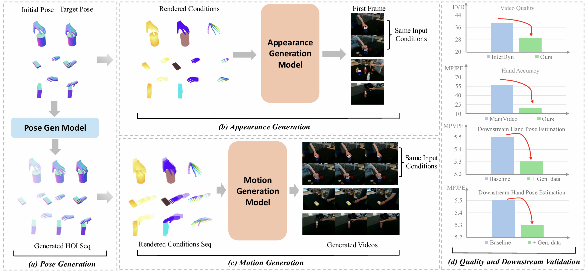

# PAM: A Pose–Appearance–Motion Engine for Sim-to-Real HOI Video Generation

This repository is an official implementation for:

**PAM: A Pose–Appearance–Motion Engine for Sim-to-Real HOI Video Generation**

> Authors: Mingju Gao, Kaisen Yang, Huan-ang Gao, Bohan Li, Ao Ding, Wenyi Li, Yangcheng Yu, Jinkun Liu, Shaocong Xu, Yike Niu, Haohan Chi, Hao Chen, Hao Tang, Yu Zhang, Li Yi, Hao Zhao

<p align="center">
  <a href="https://huggingface.co/GasaiYU/PAM/tree/main"></a>
  <a href="https://gasaiyu.github.io/PAM.github.io/"></a>
</p>



## Getting Started
### 🔧 Installation
You can set up the environment using the provided `environment.yaml` file. We recommend using Conda to manage the dependencies. This project requires **CUDA 12.1**.

```bash
conda env create -f environment.yaml
conda activate PAM
```

You should install manopth from https://github.com/hassony2/manopth

### 📂 Data Preparation

Please download the necessary datasets from their official sources:

- **DexYCB**: Visit the [official website](https://dex-ycb.github.io/) to download the dataset. You might also need the [toolkit](https://github.com/NVlabs/dex-ycb-toolkit) for processing.
- **OakInk2**: Visit the [official website](https://huggingface.co/datasets/kelvin34501/OakInk-v2) and their [GitHub repository](https://github.com/oakink/OakInk2) for download instructions and data setup.

### 📋 Conditions Preparation for DexYCB Dataset

To enable appearance and motion generation, you need to prepare the rendering conditions by following these steps:

**Step 1: Convert DexYCB to Videos**

Convert the DexYCB dataset into video format for subsequent processing:

```bash
python appearance_gen/utils/dexycb_to_videos.py --input_root /path/to/dexycb --output_root /path/to/dexycb_videos
```

**Step 2: Extract Depth Conditions**

Extract depth maps from the video sequences as control signals. We leverage [DepthCrafter](https://github.com/Tencent/DepthCrafter) to extract depth from videos. You need to mask the background and keep only the foreground using the seg mask.

**Step 3: Generate Hand Keypoints and Semantic Masks**

Generate hand keypoint annotations and semantic segmentation masks to guide the generation process. These conditions are processed in the dataloader.

**Step 4: Extract Video Captions**

Generate descriptive captions for the video sequences to provide textual guidance for the appearance generation model. We provide a caption extraction tool at `appearance_gen/utils/description_extract.py`, and pre-extracted prompts for DexYCB are available in `dexycb_prompt.jsonl`.

**Step 5: Generate Filelist**

Generate the file list that specifies input data paths for training and inference:

```bash
python appearance_gen/utils/gen_s0_split_filelist.py --root /path/to/dexycb_videos --save_path_root /path/to/filelist/dir
```

The final dataset structure should look like:

```
data/
├── dexycb_videos/                      # Step 1: Converted videos
│   └── {subject}/                      # e.g., 20200709-subject-01
│       └── {sequence}/                 # e.g., 20200709_141754
│           └── {camera_id}/            # e.g., 836212060125
│               ├── video.mp4
│               └── descriptions.json
├── dexycb_depth/                       # Step 2: Depth conditions
│   └── {subject}/
│       └── {sequence}/
│           └── {camera_id}/
│               └── depth.mp4
├── dexycb_fore_tracking/               # Step 3: Hand keypoints & semantic masks
│   └── {subject}/
│       └── {sequence}/
│           └── {camera_id}/
│               └── ...
├── dexycb_filelist/                    # Step 5: Generated filelists
└── dexycb_prompt.jsonl                 # Step 4: Video captions
```

### 📋 Conditions Preparation for OakInk2 Dataset

**Step 1: Generate Filelist**

Generate the video and conditions filelist for OakInk2:

```bash
python appearance_gen/utils/gen_oakink2_filelist.py
```

We also provide pre-generated training video paths in `appearance_gen/utils/oakink2_videos.txt`.

**Step 2: Extract Depth Conditions**

Extract depth maps from the rendered sequences as control signals using [DepthCrafter](https://github.com/Tencent/DepthCrafter). Note that you need to mask the background and keep only the foreground using the segmentation mask.

**Step 3: Generate Hand Keypoints and Semantic Masks**

Generate segmentation masks and hand keypoint annotations:

```bash
python appearance_gen/utils/gen_hand_seg_oakink2.py \
    --filelist_path /path/to/video/filelist \
    --video_len 49 \
    --root_dir /path/to/dataset/root
```

**Step 4: Extract Video Captions**

Extract descriptive captions using LLaVA as described in the DexYCB section above.

### 🎨 Appearance Generation

Once you have prepared the conditions and filelists, you can train the appearance generation model using our provided scripts. You can also download the dataset from our [huggingface](https://huggingface.co/GasaiYU/PAM/tree/main/appearance_gen)

**Configuration**

Before training, you need to modify the training script `appearance_gen/script/train.sh` to specify the following paths:

- `--data_root`: Root directory containing your dataset
- `--train_caption_column`: Path to training video captions file
- `--train_video_column`: Path to training video list file
- `--train_depth_column`: Path to training depth conditions file
- `--train_label_column`: Path to training label file
- `--valid_caption_column`: Path to validation video captions file
- `--valid_video_column`: Path to validation video list file
- `--valid_depth_column`: Path to validation depth conditions file
- `--valid_label_column`: Path to validation label file
 
**Training**

The training uses DeepSpeed for distributed training with mixed precision (bf16). You can adjust the training configuration in `appearance_gen/config.yaml` if needed.

```bash
cd appearance_gen

# Modify script/train.sh with your data paths first
bash script/train.sh
```

**Note**: The default configuration uses 4 GPUs with DeepSpeed ZeRO stage 2. Adjust `num_processes` in `config.yaml` according to your available GPU resources.

**Inference**

After training, you can run inference using the trained ControlNet model. First, modify `script/infer_double.sh` with the following parameters:

- `--local_path`: Path to the trained ControlNet checkpoint (e.g., `controlnet.bin`)
- `--save_path`: Directory to save the generated results.

And other validation dataset filelist.

```bash
bash script/infer_double.sh
```

The inference script will load the trained model and generate appearance results for the input conditions.

### 🏃 Motion Generation

#### Prepare Training Latents

To accelerate the training process, we pre-compute the training latents offline. Run the following scripts:

```bash
# For DexYCB dataset
bash scripts/prepare_dataset_dexycb.sh

# For OakInk2 dataset
bash scripts/prepare_dataset_oakink2.sh
```

After generating the latents, merge them using:

```bash
python appearance_gen/utils/merge_latents.py \
    --src_dir /path/to/latents/src/dir \
    --dst_dir /path/to/latents/dst/dir 
```

#### Training

We provide training scripts based on [DeepSpeed](https://github.com/deepspeedai/DeepSpeed) for efficient distributed training.

```bash
# For DexYCB dataset
bash scripts/train_dexycb_motion.sh

# For OakInk2 dataset
bash scripts/train_oakink2_motion.sh
```

You can customize the conditioning inputs via the `--used_conditions` argument. By default, we use three conditions (`hand_keypoints`, `depth`, `seg_mask`) as proposed in the paper

#### Inference

Before running inference, convert the trained checkpoint to the standard format:

```bash
python convert_ckpt.py \
    /path/to/checkpoint/dir \
    /path/to/save/dir \
    --safe_serialization
```

Then run the evaluation scripts:

```bash
# For DexYCB dataset
bash scripts/evaluate_dexycb.sh

# For OakInk2 dataset
bash scripts/evaluate_oakink2.sh
```

> **Note:** Make sure to specify the validation file list in the corresponding script before running.

### 🔄 Sim2Real Transfer

#### Data Preparation

First, prepare the motion sequence using [GraspXL](https://github.com/zdchan/GraspXL). The data directory should follow this structure:

```
sim_data_root/
├── rendered_rgb_*.png
├── rendered_normal_*.png
├── rendered_depth_*.png
├── rendered_seg_mask_*.png
└── rendered_hand_keypoints_*.png
```

#### Appearance Generation

Generate the first frame with realistic appearance:

```bash
bash appearance_gen/script/infer_double_wild.sh
```

> **Note:** Specify the relevant keywords in the script before running. After generation, select the desired first frame for motion synthesis.

#### Motion Generation

Run the motion generation pipeline:

```bash
python testing/evaluation_sim.py \
    --root_dir /path/to/sim/root \
    --start_frame_filelist /path/to/selected/filelist \
    --transformer_path /path/to/checkpoint \
    --output_dir /path/to/output
```

## 🙏 Acknowledgement

This project builds upon the following excellent works:
- [GraspXL](https://github.com/zdchan/GraspXL)
- [x-flux](https://github.com/XLabs-AI/x-flux)
- [DiffusionAsShader](https://github.com/IGL-HKUST/DiffusionAsShader) 